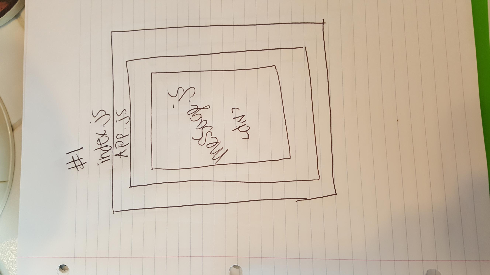
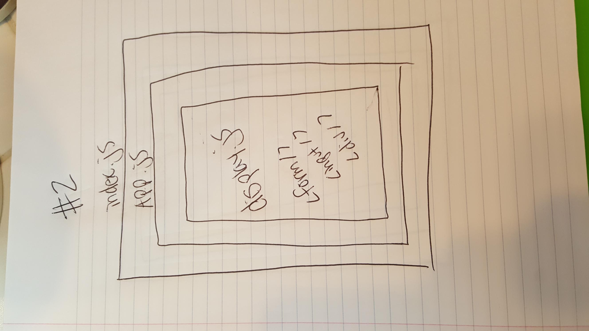
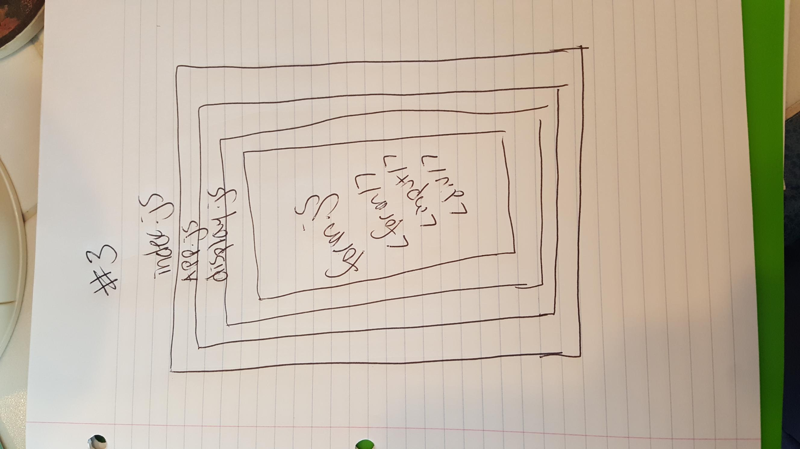

## LAB: Testing & Deployment

### Author: Siobhan Niess

## Assignment 1: Props Practice

### Part 1

### Links and Resources
- [props practice code sandbox site](https://zqw980o1q4.codesandbox.io/)
- [props practice code sandbox repo](https://codesandbox.io/s/zqw980o1q4)

### Modules
- `index.js` this holds all of the functionality
- `public/index.html` this holds the React boilerplate

### Part 2

### Links and Resources
- [modularized props practice code sandbox site](https://1z7k8qr754.codesandbox.io/)
- [modularized props practice code sandbox repo](https://codesandbox.io/s/1z7k8qr754)

### Modules
#### `modulename.js`
##### Exported Values and Methods
- `public/index.html` this holds the React boilerplate
- `src/app.js` this holds the public core app functionality
- `src/components/message/message.js` this holds the message functionality
- `src/index.js` this renders the whole app
- `src/styles.css` this holds some of the styling

#### UML

## Assignment 2: Internal State Practice

### Part 1

### Links and Resources
- [internal state practice code sandbox site](https://9lmzl2vq3p.codesandbox.io/)
- [internal state practice code sandbox repo](https://codesandbox.io/s/9lmzl2vq3p)

### Modules
- `index.js` this holds all of the functionality
- `public/index.html` this holds the React boilerplate

### Part 2

### Links and Resources
- [modularized internal state practice code sandbox site](https://ym8r9z5ozv.codesandbox.io/)
- [modularized internal state practice code sandbox repo](https://codesandbox.io/s/ym8r9z5ozv)

### Modules
#### `modulename.js`
##### Exported Values and Methods
- `public/index.html` this holds the React boilerplate
- `src/app.js` this holds the public app functionality
- `src/components/display/display.js` this holds the display functionality
- `src/index.js` this renders the whole app
- `src/styles.css` this holds some of the styling

#### UML

## Assignment 3: External State Practice

### Part 1

### Links and Resources
- [external state practice code sandbox site](https://7m2n4j2r4x.codesandbox.io/)
- [external state practice code sandbox repo](https://codesandbox.io/s/7m2n4j2r4x)

### Modules
- `index.js` this holds all functionality
- `public/index.html` this holds the React boilerplate

### Part 2

### Links and Resources
- [modularized external state practice code sandbox site](https://5482xz11nl.codesandbox.io/)
- [modularized external state practice code sandbox repo](https://codesandbox.io/s/5482xz11nl)

### Modules
#### `modulename.js`
##### Exported Values and Methods
- `public/index.html` this holds the React boilerplate
- `src/app.js` this holds the public app functionality
- `src/components/display/display.js` this holds the display functionality
- `src/components/form/form.js` this holds the display functionality
- `src/index.js` this renders the whole app
- `src/styles.css` this holds some of the styling

#### UML
